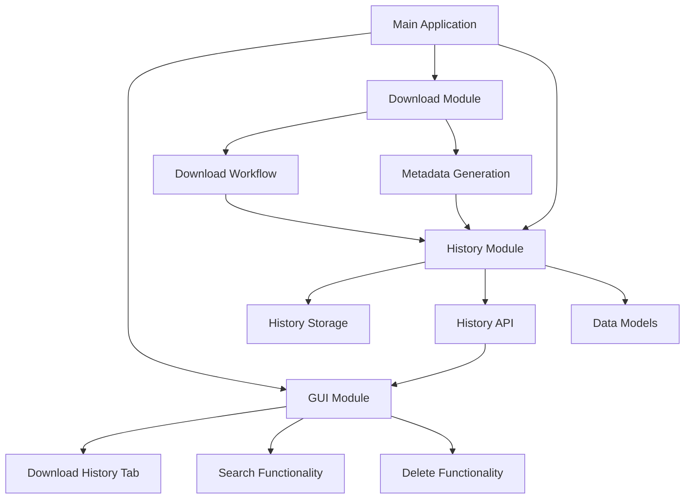

# Download History/Management Feature Implementation Plan

## Overview

This document outlines the implementation plan for adding download history and management features to the Civitai Model Downloader application. The features will allow users to maintain a persistent list of downloaded models, view/search their download history, and delete models directly from the GUI.

## Architecture Overview



## Module Breakdown

### 1. History Module (`src/history_manager.py`)

This module will handle all history-related functionality:

- Persistent storage of download history
- Adding new entries to history
- Retrieving history entries
- Searching through history
- Deleting entries from history
- Scanning existing download directories

### 2. GUI Integration (`src/gui.py`)

- Add a new tab for download history
- Implement search functionality
- Add delete buttons with confirmation dialogs
- Display model information in a user-friendly way

### 3. Data Model

The history will store information about each downloaded model:

- Model ID and version ID
- Model name and version name
- Download path
- Download date
- Model type
- Base model
- File sizes
- Trigger words
- Tags/categories

## Implementation Steps

### Phase 1: Core History Functionality

1. Create `src/history_manager.py`
2. Implement JSON-based storage system
3. Create functions for adding/retrieving history entries
4. Implement search functionality
5. Add delete functionality

### Phase 2: Integration with Download Workflow

1. Modify download workflow to automatically add entries to history
2. Ensure consistency between file system and history

### Phase 3: GUI Implementation

1. Add new tab for download history
2. Implement search UI
3. Add delete functionality with confirmation
4. Display model information in a grid/list view

### Phase 4: Advanced Features

1. Implement directory scanning to populate history
2. Add sorting options
3. Add export/import functionality for history
4. Add bulk operations

## Data Structure

```json
{
  "downloads": [
    {
      "id": "unique_identifier",
      "model_id": 12345,
      "version_id": 67890,
      "model_name": "Example Model",
      "version_name": "Example Version",
      "model_type": "LORA",
      "base_model": "SD 1.5",
      "download_path": "/path/to/model",
      "download_date": "2023-01-01T00:00:00Z",
      "file_size": 123456789,
      "trigger_words": ["word1", "word2"],
      "tags": ["tag1", "tag2"],
      "metadata_path": "/path/to/metadata.json"
    }
  ]
}
```

## File Structure Changes

```
src/
├── civitai_downloader.py
├── gui.py
├── html_generator.py
├── history_manager.py  <- New module
├── __init__.py
└── __pycache__/
```

## Integration Points

1. **Download Workflow Integration**: When a download completes successfully, the system will automatically add an entry to the history.

2. **GUI Integration**: The main GUI will have a new tab for viewing history with search and delete capabilities.

3. **File System Consistency**: When models are deleted through the history interface, both the files and history entries will be removed.

## Error Handling

- Handle cases where history file is corrupted
- Handle cases where files referenced in history no longer exist
- Provide graceful degradation when history features fail

## Testing Considerations

- Test history persistence across application restarts
- Test search functionality with various query types
- Test delete functionality and file cleanup
- Test edge cases like duplicate entries
